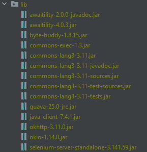

# test-wikipedia
Two testcases for wikipedia APK using JAVA and Appium

## Installation
To start using tests you need to have next things in your computer:
[Java](https://www.guru99.com/install-java.html), [Android Studio](https://developer.android.com/studio), [Appium](http://appium.io/docs/en/writing-running-appium/running-tests/), any JAVA IDE(E.g. IntelliJ Idea).
You need to create the [emulator](https://developer.android.com/studio/run/emulator) as well. 
Next step is to add libs on tour local computer:

###Required libs


After adding those libs to lib folder you need to add them to libraries. Right click on lib/ 
```folder -> Add as library -> Level = global -> OK.```

###Running
First you need to run the Appium server locally. Then start the simulator and drag wiki.apk file into it.
If you need any assistance, please email mishailipenko2@gmail.com.